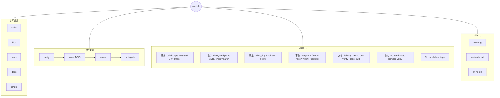
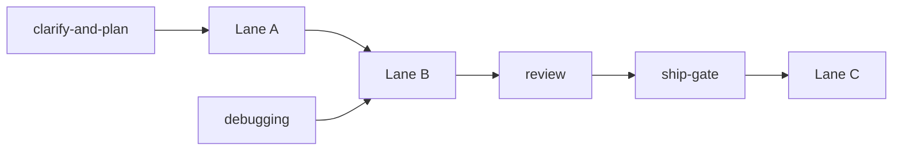

# My Toolkit

个人工具库：Cursor / Claude **Skills**、可运行的 **Tools**、小型 **Agents**，以及按能力打包的 **Kits**（例如自建搜索）。

由原先的纯 skills 仓库演进为混合布局（**仓库内按用途分类，安装仍扁平**；多部件能力进 `kits/`）。布局锁定见 [**ADR-001**](docs/adr/001-toolkit-three-layer-layout.md)。文档入口：[`docs/README.md`](docs/README.md)。

## 架构一览

一眼看分层与分布（设计说明见 [`docs/design/2026-07-26-readme-architecture-mindmap.md`](docs/design/2026-07-26-readme-architecture-mindmap.md)）。日常该调哪条链：[`skills/orchestration/build-loop/workflows/recommended.md`](skills/orchestration/build-loop/workflows/recommended.md)。



主链细看：



| 层 | 放什么 | 例子 |
| --- | --- | --- |
| `skills/` | 几乎只有 `SKILL.md` 的流程 | `work-lanes`, `clarify-and-plan` |
| `kits/` | Docker / 脚本 / 钩子 + 可选 skill | `searxng-search`, `git-hooks` |
| `tools/` | 跨 kit 共享 CLI | `run-gates` |
| `docs/` | 设计、决议、模板、ADR | `docs/design/*`, `docs/templates/*` |

## 目录结构

```
.
├── skills/                      # 流程技能：仓库内分类，安装名 = 叶子目录
│   ├── README.md
│   ├── _template/
│   ├── orchestration/           # work-lanes, build-loop, ship-gate, …
│   ├── design/                  # clarify-and-plan, ADR, improve-arch
│   ├── quality/                 # debugging, incident, skill-fit
│   ├── review/                  # merge-CR, code-review, hunk, commit
│   ├── docs/                    # delivery, doc-verify, case-card
│   ├── frontend/                # frontend-craft, browser-verify
│   └── ci/                      # parallel-ci-triage
├── kits/                        # 可运行多部件（资产；可选 skill/）
│   ├── README.md                # 边界：编排在 skills/，禁止同名双 SKILL
│   ├── _template/
│   ├── searxng-search/
│   ├── frontend-craft/          # 资产；编排在 skills/frontend/frontend-craft
│   └── git-hooks/
├── tools/                       # 跨 kit 共享 CLI（run-gates 等）
├── agents/
├── docs/                        # 从 docs/README「从这里读」；ADR 在 docs/adr/
├── scripts/
│   ├── install.ps1 / install.sh
│   ├── check-layout.ps1         # 发现 + 叶子唯一 + 悬空路径 + scan-skills
│   └── scan-skills.ps1
└── README.md
```

更细约定：[`skills/README.md`](skills/README.md)、[`kits/README.md`](kits/README.md)、[ADR-001](docs/adr/001-toolkit-three-layer-layout.md)。

## 安装到本地

技能需要出现在 `~/.cursor/skills/`（或项目 `.cursor/skills/`）才会被 AI 识别。

安装脚本会安装：

1. `skills/**/<leaf>/SKILL.md`（跳过 `_…`；安装名 = **叶子**目录名，扁平落到 `~/.cursor/skills/<leaf>/`）
2. `kits/<name>/skill/SKILL.md`（跳过 `_…`；安装名为 kit 目录名）

**Windows (PowerShell):**

```powershell
./scripts/install.ps1
./scripts/install.ps1 -Copy   # 无符号链接权限时用复制
```

**macOS / Linux:**

```bash
bash scripts/install.sh
bash scripts/install.sh --copy
```

默认符号链接（改仓库即生效）。`-Copy` / `--copy` 改为复制。

## 冒烟检查

```powershell
./scripts/check-layout.ps1    # layout + discovery; also runs smoke-install
./scripts/smoke-install.ps1   # install.sh set -e / kit tools / wipe guards
./scripts/test-run-gates.ps1  # DryRun discovery + empty-path exit 4
./tools/run-gates.ps1         # discover + run gates (this repo: check-layout)
```

出货前（任意仓库）：Cursor skill `/ship-gate`，或直接跑 `tools/run-gates.ps1`（目标仓内有副本，或设置 `MY_SKILLS_ROOT` 指向本仓库）。见 [`tools/README.md`](tools/README.md)。

CI（GitHub Actions）：`windows-latest` 上跑同一套 `check-layout.ps1`（内嵌 smoke-install）。见 [`.github/workflows/smoke.yml`](.github/workflows/smoke.yml)。

## 新建 skill

1. 复制 `skills/_template` → `skills/<category>/<leaf>`（分类见 `skills/README.md`）
2. 编辑 `SKILL.md`（`name` = leaf）
3. 重新运行安装脚本

## 新建 kit

1. 复制 `kits/_template` → `kits/<name>`（不要用 `_` 前缀）
2. 按需填写 `skill/`、`tools/`、`agents/`、`docker/`
3. 若有 `skill/SKILL.md`，重新运行安装脚本

## SKILL.md 规范要点

- `name`：最多 64 字符，仅小写字母、数字、连字符
- `description`：说明**做什么（WHAT）**和**何时用（WHEN）**，第三人称，含触发关键词
- 正文尽量 < 500 行；细节拆到同目录 `reference.md` 等
- 路径用正斜杠风格（`scripts/x.py`）
