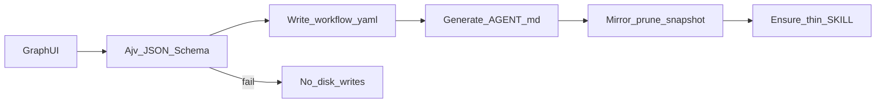

# Agent Flow Studio (Phase 2)

Status: **Approved** (clarify-and-plan §1–§5; Opus polish; **D1 accepted** 2026-07-27).  
Related: [ADR-002](../adr/002-agents-as-role-packs.md), [ADR-003](../adr/003-workflow-yaml-as-studio-sot.md),  
field checklist [`agent-workflow-fields.md`](agent-workflow-fields.md),  
plan [`plans/2026-07-27-agent-flow-studio.md`](plans/2026-07-27-agent-flow-studio.md).

## Goal

Local **bidirectional sync workbench** for role packs: graph-edit workflows, read/write the
my-skills checkout, without adding a fourth install kind (ADR-001).

## Locked decisions

| Topic | Choice |
| --- | --- |
| Product | Bidirectional workbench (not export-only) |
| Runtime | Browser SPA in `kits/agent-flow-studio/` + Node API on `127.0.0.1` |
| Root | `--root` > `MY_SKILLS_ROOT` > cwd; must contain `agents/` + `skills/orchestration/` |
| UI | Graph-primary (React + Vite + React Flow); property panel secondary |
| Edit SoT (studio-managed) | `agents/<name>/workflow.yaml` + JSON Schema |
| Derived | Regenerate `AGENT.md` on save; `prompt.md` only if `prompt` set |
| Save | Validate → write SoT → **recursive mirror+prune** → `skills/orchestration/<name>/agent/` → ensure thin `SKILL.md` |
| Kit skill | **No** `kits/agent-flow-studio/skill/SKILL.md` (ADR-001 dual-SKILL ban) |
| Cursor entry | Orchestration thin skill leaf `agent-flow-studio` (launch instructions only; Lane B) |

## D1 — ship-review handling (accepted)

Hand-authored [`agents/ship-review/AGENT.md`](../../agents/ship-review/AGENT.md) must not be
silently overwritten by a lossy generator.

- **Primary acceptance:** graph-first **fixture** agent created in the studio (byte-stable
  generate round-trip).
- **`ship-review` migrate:** writes `workflow.yaml` and renders the graph; **does not** rewrite
  `AGENT.md`. Regenerating that file is a later, human-diff-reviewed step.

## Dual source-of-truth (see ADR-003)

- Agent **with** `workflow.yaml` → YAML is orchestration SoT; `AGENT.md` is generated.
- Agent **without** → `AGENT.md` remains hand-authored SoT.
- `check-layout` recursive equality is unchanged and covers every file under the pack
  (including `workflow.yaml`).

## Non-goals (v1)

Condition execution; `agent` / `human` node UI; auto-rewriting thin `SKILL.md` beyond scaffold;
regenerating `ship-review/AGENT.md`; cloud; File System Access API-only mode; mandatory CI for
studio tests.

## Layout

```
kits/agent-flow-studio/
  README.md
  schema/workflow.schema.json
  server/                 # Node API + optional static serve of web/dist
  web/                    # Vite + React + React Flow
  test/                   # vitest (local; not forced into smoke CI)
agents/<name>/
  workflow.yaml           # present when studio-managed
  AGENT.md
  prompt.md               # optional
skills/orchestration/<name>/
  SKILL.md                # thin; scaffolded on first save if missing
  agent/                  # full recursive mirror of agents/<name>/
# Lane B also adds orchestration leaf agent-flow-studio/SKILL.md (launch only; no agent/)
```

## Save pipeline



## Schema (v1 summary)

Required: `id` (== folder name), `name`, `version` (`"1"`), `nodes[]`, `edges[]`.  
Accepted node types: `step` | `skill` | `gate`.  
Reserved / rejected in v1: `agent` | `human`.  
Optional: `summary`, `when[]`, `when_not[]`, `inputs[]`, `outputs[]`, `banned_actions[]`,
`prompt`, `defaults`, `ui` layout.  
Edge `condition`: stored label only (not executed).

Formal schema path (Lane B): `kits/agent-flow-studio/schema/workflow.schema.json`.

## Generator / migrate contracts

**Generator** (deterministic, idempotent): map YAML → `AGENT.md` sections in fixed order
(Purpose, When, When not, Steps, Handoffs, Boundaries, Inputs, Outputs).

**Migrate** (best-effort): parse existing `AGENT.md` → write **only** `workflow.yaml`. Never
edits `AGENT.md`. Used for `ship-review` import under D1.

## API (sketch)

`GET /api/meta`, `GET /api/agents`, `GET /api/agents/:name`,  
`POST /api/agents/:name/migrate`, `PUT /api/agents/:name` (full save).  
Bind `127.0.0.1`; name regex `^[a-z0-9][a-z0-9-]*$`; realpath confined under ROOT.

## UI (sketch)

Agent list | React Flow canvas + palette | property panel | Save / Migrate / errors.  
Dev: Vite proxy `/api`. Run: API serves `web/dist` (single origin).

## Gate notes

- Gitignore kit `node_modules` / `dist`.
- `check-layout` dangling `*.md` scan must exclude `node_modules` and `dist` (Lane A unblock).
- Kit-local `npm test` recommended; not required in repo smoke CI for v1.

## Success criteria (Phase 2 v1)

- [ ] Fixture agent save → SoT ↔ snapshot recursively equal; thin SKILL present  
- [ ] Generator re-save idempotent on fixture  
- [ ] `ship-review` migrate writes YAML; **AGENT.md unchanged** (D1)  
- [ ] `check-layout` PASS with kit `node_modules` present locally  
- [ ] ADR-003 Accepted; checklist + `agents/README` sync rule updated  

## Open for Lane B

Implementation of kit, schema file, server, web, thin skill, menu entry — see plan.
